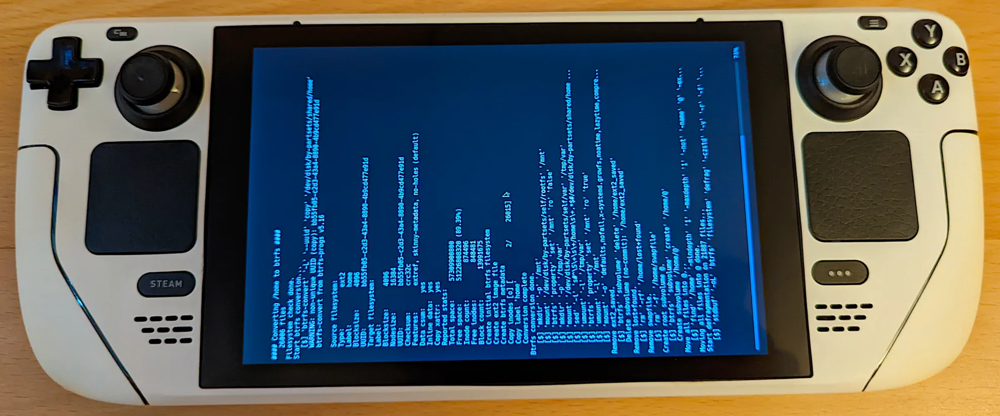
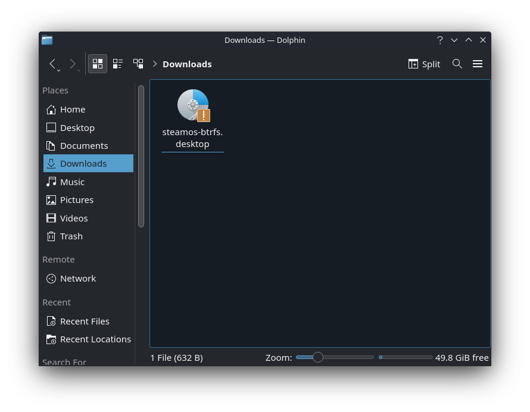
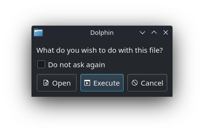
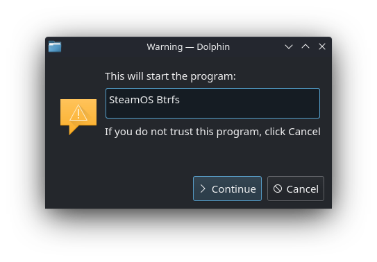

# SteamOS 3/Steam Deck Btrfs converter 

This injector will install the necessary payload to keep a btrfs formatted /home even through system updates. You may also choose to only install the support for formatting and mounting of multiple filesystems for the SD cards.
It will allow to mount btrfs, f2fs, ext4, fat, exfat and ntfs formatted SD cards and will also force new SD cards to be formatted as btrfs by default or a user configured filesystem.

Btrfs with its transparent compression and deduplication capabilities can achieve impressive storage gains but also improve loading times because of less data being read. It also supports instant snapshotting which is very useful to roll back to a previous state.

**WARNING!!!! If you decide to so, it will install a service that will attempt on the next boot to convert the ext4 /home partition into btrfs and depending on the already used storage this operation may fail or take a long time!**

**Make sure you have at least 10-20% free space available before attempting the conversion (`df -h /home` 80-90% use with at least 10-20 GiB available space)**

- https://wiki.archlinux.org/title/Btrfs
- https://wiki.archlinux.org/title/F2FS

## Features

- Btrfs /home conversion from ext4 (optional)
- Btrfs, f2fs, ext4, fat, exfat, ntfs formatted SD card support
- Btrfs, f2fs, ext4, fat, exfat, ntfs formating of SD card
- Progress dialog and logging during the home conversion!
- Install additional pacman packages into the rootfs automatically and persist through updates
- **Survives updates and branch changes!**
- Steam's `downloading` and `temp` folders as subvolumes with COW disabled
- Update check
- Non-linux filesystems (fat, exfat, ntfs) have their `compatdata` folder bind mounted from the internal storage for proton support (and don't forget that with fat you are restricted to a maximum of 4GB per file!)



## Install

### Desktop installer

**Switch into Desktop mode**

**You can download the following easy to use .desktop installer:**

[](https://gitlab.com/popsulfr/steamos-btrfs/-/raw/main/steamos-btrfs.desktop?inline=false)

**CAUTION**: there's not an easy way back if you proceed! Once the /home partition is converted, you can not go back to ext4 and keep your files.
The original files that have been changed are backed up with the `.orig` extension. Keep in mind that they are specifically changed to allow for a btrfs `/home`.
It is safe to revert to the original files if the btrfs conversion was not attempted.

**Please make sure you have enough free space before attempting the conversion. At least 10-20GiB and/or 10-20% free space should usually be fine.**

**When mounting an SD card that is fat, exfat, ntfs formatted:** the eject function in the Steam Client will not work because the `compatdata` folder is bind mounted from the internal storage. To manually unmount: `sudo systemctl stop sdcard-mount@mmcblk0p1.service`.

**Double-click the downloaded file**



**Execute the .desktop file**



**Press Continue to execute and follow the instructions.**

**If no password has been set, you will be prompted for a new one.** 



### CLI Installer

#### Configuration

Before the installation you may want to modify the [Configuration options](#configuration-options)
* If it's a first time installation, edit `./files/etc/default/steamos-btrfs`.
* Otherwise edit `/etc/default/steamos-btrfs` as it will take precedence over the local one.
* You can also supply [command line arguments or environment variables](#command-line-arguments) to the installer

#### CLI Install

```sh
t="$(mktemp -d)"
curl -sSL https://gitlab.com/popsulfr/steamos-btrfs/-/archive/main/steamos-btrfs-main.tar.gz | tar -xzf - -C "$t" --strip-components=1
"$t/install.sh"
rm -rf "$t"
```

Once the payload is installed you can also restart the installer from the rootfs:

```sh
/usr/share/steamos-btrfs/install.sh
```

#### Command line arguments

```
SteamOS Btrfs
Version: 1.0.0.20221104
Usage: '/usr/share/steamos-btrfs/install.sh' [OPTION]... [rootfs dev]...
Example: '/usr/share/steamos-btrfs/install.sh' --nogui /dev/disk/by-partsets/self/rootfs

  --help                 show help
  --noninteractive       run in noninteractive mode
                         apply options from config files, env vars or defaults
                         (env var: 'NONINTERACTIVE')
                         (default: 0)
  --nogui                run without gui prompts, force text prompts
                         (env var: 'NOGUI')
                         (default: 0)
  --noautoupdate         disable automatic fetching of the latest script version when updating the system, changing channels or on version check
                         (env var: 'NOAUTOUPDATE')
                         (file flag: '/usr/share/steamos-btrfs/disableautoupdate')
                         (default: 0)
  --noconverthome        disable home conversion
                         (env var: 'NOCONVERTHOME')
                         (file flag: '/usr/share/steamos-btrfs/disableconverthome')
                         (default: 0)
  --customprompt PATH    set path to a custom prompt script or executable
                         First argument supplied is the title, second argument the message to display, third argument label for yes, fourth argument label for no, fifth argument label for cancel
                         Env var 'EPROMPT_VALUE_DEFAULT' holds the default value
                         Should return 0 if OK, 1 if not, 2 if cancelled
                         (env var: 'CUSTOMPROMPT')
                         (default: '')

Expert config options:
  --STEAMOS_BTRFS_HOME_MOUNT_OPTS OPTS             set the /home mount options to use
                                                   (env var: 'STEAMOS_BTRFS_HOME_MOUNT_OPTS')
                                                   (default: 'defaults,nofail,x-systemd.growfs,noatime,lazytime,compress-force=zstd,space_cache=v2,autodefrag')
  --STEAMOS_BTRFS_HOME_MOUNT_SUBVOL SUBVOL         set the /home subvolume name to use
                                                   (env var: 'STEAMOS_BTRFS_HOME_MOUNT_SUBVOL')
                                                   (default: '@')
  --STEAMOS_BTRFS_ROOTFS_PACMAN_EXTRA_PKGS PKGS    set the extra pacman packages to install
                                                   (env var: 'STEAMOS_BTRFS_ROOTFS_PACMAN_EXTRA_PKGS')
                                                   (default: '')

You can specify multiple 'rootfs dev's or none and it will default to '/dev/disk/by-partsets/self/rootfs'.
Order of priority from highest to lowest for options is: command line flags, env vars, config files ('/usr/share/steamos-btrfs/files/etc/default/steamos-btrfs', '/usr/share/steamos-btrfs/files/etc/default/steamos-btrfs', '/etc/default/steamos-btrfs'), flag files ('/usr/share/steamos-btrfs/disableconverthome', '/usr/share/steamos-btrfs/disableautoupdate').

A log file will be created at '/var/log/steamos-btrfs.log'.
```

## Remaining issues and troubleshooting

At this point the installer should be relatively mature and robust.
Once the payload is installed and the conversion was greenlit by the user, on the next boot the Steam Deck will use tmpfs as /home and attempt the btrfs conversion on the real partition.
Once it reboots it should all be working fine and the /home partition converted.
This configuration has been confirmed by me and others to survive through updates.

A log file is created at `/var/log/steamos-btrfs.log` containing the installation and the home conversion log to review the process or help with bug reports.

If the conversion of the home partition fails for any reason, the service will do its best to restore the original ext4 mount and hard mask the systemd conversion service to prevent a conversion boot loop.

Please submit the log file at `/var/log/steamos-btrfs.log` as new issue if that happens to you.

You'll need to explicitely unmask the service yourself if you want to attempt the conversion again:
```sh
sudo systemctl unmask steamos-convert-home-to-btrfs.service
```
or
```sh
sudo rm /etc/systemd/system/steamos-convert-home-to-btrfs.service
```

**Disclaimer about mounting fat, exfat, ntfs filesystems: the eject functionality in the Steam client will not work because the `compatdata` folder is bind mounted from the internal storage. To unmount the SD card manually execute:**

```sh
sudo systemctl stop sdcard-mount@mmcblk0p1.service
```

## Updating or changing config options

At any time you can rerun the installer and let it download the latest version and go through the installation again to enable the latest changes or simply apply changed settings (`/usr/share/steamos-btrfs/install.sh`).
Disabling the home conversion won't have any effect on an already converted home partition.
You should still select the `Convert /home` option if you want to update the home partition's mount flags modified through `/etc/default/steamos-btrfs`.

At times updates may change the default config options and you may want to merge the changes with your own: [Configuration options](#configuration-options)

If you don't want to be prompted while running the script you can set the `NONINTERACTIVE=1` environment variable:
```sh
NONINTERACTIVE=1 /usr/share/steamos-btrfs/install.sh
```
or as command line argument:
```sh
/usr/share/steamos-btrfs/install.sh --noninteractive
```

You may force off the gui prompts with `NOGUI=1` or `--nogui`, it should otherwise detect if a desktop environment is running and fallback to text prompts
```sh
NOGUI=1 /usr/share/steamos-btrfs/install.sh
/usr/share/steamos-btrfs/install.sh --nogui
```

## Uninstall

- the underlying rootfs needs to be mounted somewhere else and the readonly mode disabled
  + `sudo mount /dev/disk/by-partsets/self/rootfs /mnt`
  + `sudo btrfs property set /mnt ro false`
- the original files are backed up next to the new files with a `.orig` extension so you can move them back into position
  + `sudo find /mnt -type f,l -name '*.orig' -exec sh -c 'mv -vf "$1" "${1%.*}"' _ '{}' \;`
- make sure to disable the conversion systemd services or it will attempt to convert `/home` again
  + `sudo rm /mnt/usr/lib/systemd/system/*.target.wants/steamos-convert-home-to-btrfs*.service`
- the `/home` partition will need to be force formatted back to ext4 if it has been converted to btrfs (obviously all files on it will be lost!)
  + you can edit `/etc/fstab` to mount `/home` in tmpfs for the next boot : `tmpfs /home tmpfs defaults,nofail,noatime,lazytime 0 0`
  + force format the real `/home` to ext4 : `sudo mkfs.ext4 -m 0 -O casefold -F -L home /dev/disk/by-partsets/shared/home`
  + change the line in `/etc/fstab` back to ext4 : `/dev/disk/by-partsets/shared/home /home   ext4    defaults,nofail,x-systemd.growfs 0       2`

## Mount options

### Btrfs mount options

The following mount options are used by default:

- `noatime,lazytime`: to keep writes to a minimum
- `compress-force=zstd`: force zstd compression always on. zstd is smart enough to do the right thing on uncompressible data, works better and achieves better results than the normal heuristics for compression. You can set a specific compression level by appending `:<level>` to the type e.g.: `compress-force=zstd:6`. The default level is 3 and going over 6 is rarely worth it (compression/decompression complexity grows quickly after that).
- `space_cache=v2`: make sure the newer implementation is used
- `autodefrag`: small random writes are queued up for defragmentation, invests more effort during writes to achieve as much contiguous data as possible. Interesting for games where more fragmentation can lead to loading stutter.
- `subvol=@`: by default it will create a subvolume `@` (can be changed in the config) which is used as real root of the filesystem. SD Cards formatted as btrfs will be searched for the `@` subvolume or fallback to `/`.
- `ssd_spread`:  attempts to allocate into bigger and aligned chunks of unused space for a potential performance boost on SD cards.
- `commit`: (not by default) the commit interval, you may achieve good results by raising it to something like 120 seconds `commit=120` especially on the SD card

### F2FS mount options

- `noatime,lazytime`: to keep writes to a minimum
- `compress_algorithm=zstd`: use zstd compression. You can set a specific compression level by appending `:<level>` to the type e.g.: `compress_algorithm=zstd:6`. The default level is 3 and going over 6 is rarely worth it (compression/decompression complexity grows quickly after that).
- `compress_chksum`: verify compressed blocks with a checksum
- `atgc,gc_merge`: use better garbage collector, async garbage collection

### ext4 mount options

- `noatime,lazytime`: to keep writes to a minimum

### fat mount options

**Don't forget that fat formatted SD cards are limited to 4GB per file!**

- `noatime,lazytime`: to keep writes to a minimum
- `uid=1000,gid=1000`: make it usable for the default `deck` user
- `utf8=1`: force utf8 support

### exfat mount options

- `noatime,lazytime`: to keep writes to a minimum
- `uid=1000,gid=1000`: make it usable for the default `deck` user

### ntfs mount options

- `noatime,lazytime`: to keep writes to a minimum
- `uid=1000,gid=1000`: make it usable for the default `deck` user
- `big_writes`: prevent splitting of write buffers into 4K chunks
- `umask=0022`: default bitmask of file and directories
- `ignore_case`: ignore character case when accessing a file (lowntfs-3g)
- `windows_names`: prevents names not allowed by windows

## Configuration options

A configuration file is available to change various filesystem options at [`/etc/default/steamos-btrfs`](files/etc/default/steamos-btrfs).

- `STEAMOS_BTRFS_HOME_CONVERT_OPTS`         : the options to pass to `btrfs-convert` during the `/home` conversion. You could for instance choose a different checksumming algorithm like `xxhash` instead of `crc32c` with `--checksum xxhash`.
- `STEAMOS_BTRFS_HOME_MOUNT_OPTS`           : the mount options to use for mounting the `/home` partition. Changing only this variable will not have any effect if the conversion is already done. `/etc/fstab` would need to be edited to reflect the new values and you can do this easily by running the installation script again [`./install.sh`](install.sh) (pick `Convert /home` again during installation).
- `STEAMOS_BTRFS_HOME_MOUNT_SUBVOL`         : the root subvolume to use when mounting. Changing only this variable will not have any effect if the conversion is already done. A new subvolume with the desired name would need to be created and `/etc/fstab` would need to be edited to reflect the new values.
- `STEAMOS_BTRFS_SDCARD_FORMAT_FS`          : allows you to specify what new blank SD cards will be formatted as. One of `btrfs`, `f2fs`, `ext4`.
- `STEAMOS_BTRFS_SDCARD_BTRFS_MOUNT_OPTS`   : the btrfs mount options for btrfs formatted SD cards.
- `STEAMOS_BTRFS_SDCARD_BTRFS_MOUNT_SUBVOL` : the default subvolume to mount if available. It also specifies the default subvolume to create on newly formatted btrfs SD cards.
- `STEAMOS_BTRFS_SDCARD_BTRFS_FORMAT_OPTS`  : flags to pass to `mkfs.btrfs` during the format.
- `STEAMOS_BTRFS_SDCARD_EXT4_MOUNT_OPTS`    : the ext4 mount options for ext4 formatted SD cards.
- `STEAMOS_BTRFS_SDCARD_EXT4_FORMAT_OPTS`   : flags to pass to `mkfs.ext4` during the format.
- `STEAMOS_BTRFS_SDCARD_F2FS_MOUNT_OPTS`    : the f2fs mount options for f2fs formatted SD cards.
- `STEAMOS_BTRFS_SDCARD_F2FS_FORMAT_OPTS`   : flags to pass to `mkfs.f2fs` during the format.
- `STEAMOS_BTRFS_SDCARD_FAT_MOUNT_OPTS`     : the fat mount options for fat formatted SD cards.
- `STEAMOS_BTRFS_SDCARD_FAT_FORMAT_OPTS`    : flags to pass to `mkfs.vfat` during the format.
- `STEAMOS_BTRFS_SDCARD_EXFAT_MOUNT_OPTS`   : the exfat mount options for exfat formatted SD cards.
- `STEAMOS_BTRFS_SDCARD_EXFAT_FORMAT_OPTS`  : flags to pass to `mkfs.exfat` during the format. (the `mkfs.exfat` from `exfatprogs`)
- `STEAMOS_BTRFS_SDCARD_NTFS_MOUNT_OPTS`    : the ntfs mount options for ntfs formatted SD cards.
- `STEAMOS_BTRFS_SDCARD_NTFS_FORMAT_OPTS`   : flags to pass to `mkfs.ntfs` during the format.
- `STEAMOS_BTRFS_ROOTFS_PACMAN_EXTRA_PKGS`  : additional pacman packages to install into the rootfs separated by spaces (e.g.: "compsize nfs-utils wireguard-tools ..."). You can install them easily immediately by running the installation script again [`/usr/share/steamos-btrfs/install.sh`](install.sh).

If you changed the default options and want to reset them or want to benefit from updated default options you can do the following:

Delete the modified file from the upper overlay layer:
```sh
sudo rm -f /var/lib/overlays/etc/upper/default/steamos-btrfs
```

Refresh the overlay for `/etc`:
```sh
sudo mount -o remount /etc
```

## Deduplication

Using first [rmlint](https://rmlint.readthedocs.io/en/latest/) for fast efficient file deduplication and finally [duperemove](https://github.com/markfasheh/duperemove) for block based deduplication is the most effective way to potentially reduce disk space.

You can install the tools with the installer by editing the config file `/etc/default/steamos-btrfs` (sticks through upgrades and channel changes) or using the environment variable `STEAMOS_BTRFS_ROOTFS_PACMAN_EXTRA_PKGS` or the command line argument `--STEAMOS_BTRFS_ROOTFS_PACMAN_EXTRA_PKGS 'pkgs...'`:

`/etc/default/steamos-btrfs`:
```sh
STEAMOS_BTRFS_ROOTFS_PACMAN_EXTRA_PKGS="compsize duperemove rmlint"
```
```sh
STEAMOS_BTRFS_ROOTFS_PACMAN_EXTRA_PKGS="compsize duperemove rmlint" /usr/share/steamos-btrfs/install.sh
/usr/share/steamos-btrfs/install.sh --STEAMOS_BTRFS_ROOTFS_PACMAN_EXTRA_PKGS "compsize duperemove rmlint"
```

Alternatively, install the tools locally
```sh
sudo pacman --cachedir /tmp -Sw compsize duperemove rmlint
mkdir -p ~/.local/bin
for f in /tmp/*.pkg.tar.zst ; do tar -xf "$f" -C ~/.local/bin --strip-components=2 usr/bin ; done
sudo rm /tmp/*.pkg.*
```

Set the `PATH` variable and optionally add it to the `~/.bash_profile`.
```sh
export PATH="$PATH:$HOME/.local/bin"
```

Check with `compsize` the used disk space before deduplication:
```sh
sudo compsize /home
```

First use `rmlint` on `/home`:
```sh
cd /tmp
sudo rmlint --types="duplicates" --config=sh:handler=clone /home
sudo ./rmlint.sh -d -p -r -k
sudo rm -r rmlint*
```

**DISCLAIMER: in most cases running `duperemove` will not result in a lot of space improvements and is slow.**

Then use `duperemove` which might take a while:
```sh
sudo duperemove -r -d -h --hashfile=/home/duperemove.hash --skip-zeroes --lookup-extents=no /home
```

Check the used disk space again:
```sh
sudo compsize /home
```

## Steam preallocation woes

The latest version attempts to replace Steam's `downloading` and `temp` folders (located in `Steam/steamapps/`) with btrfs subvolumes and COW disabled. This is to mitigate the issue of games downloaded through the Steam client not having the most optimal compression ratio.

If you were already using this project or you think your games' space usage is less than ideal you may want to consider to defragment and balance your Steam library manually:

For the internal storage:
```sh
sudo btrfs filesystem defrag -czstd -v -r -f /home/deck/.local/share/Steam/steamapps
sudo btrfs balance start -m -v /home/deck/.local/share/Steam/steamapps
```

For your SD card:
```sh
sudo btrfs filesystem defrag -czstd -v -r -f /run/media/mmcblk0p1/steamapps
sudo btrfs balance start -m -v /run/media/mmcblk0p1/steamapps
```

## TODO

- [ ] deduplication service
